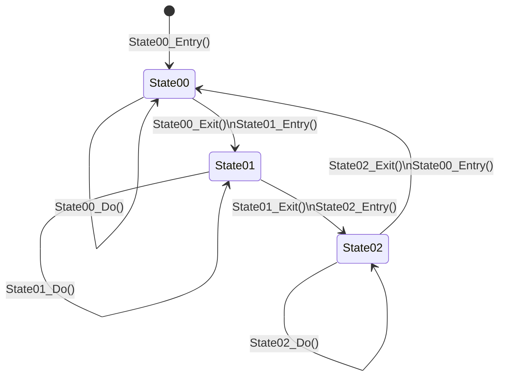

[](https://github.com/asabon/statemachine/actions/workflows/ci.yml)


# StateMachine

## Overview

Simple statemachine for embedded system written in C language.

## Requirement

- C language

## Usage

StateMachine has only 2 files.

- statemachine.h
- statemachine.c

### Sample state transition

StateMachine can achieve the following state transitions. 



- This sample has 3 states.
  - state00
  - state01
  - state02
- Each state has 3 functions.
  - entry()
  - do()
  - exit()

In this case, sample code is below.

```c
# include "statemachine.h"

int state00_entry(void)
{
    /* Do something when enter to this state. */
    return 0; /* return 0 means success this function. */
}

int state00_do(int * pNextState)
{
    /* Do something in this state. */
    *pNextState = 1; /* If next state is "1" */
    return 0; /* return 0 means success this function. */
}

int state00_exit(void)
{
    /* Do something when exit to the other state. */
    return 0; /* return 0 means success this function. */
}

/* state01, state02 should be implement here. */

int main(void)
{
    int result;
    STATEMACHINE_T statemachine;
    /* State table */
    /* This sample has 3 states. (state00, state01, state02) */
    STATE_T statelist[] = {
        /* Entry(),     Do(),       Exit() */
        {state00_entry, state00_do, state00_exit}, /* state00 (state id = 0) */
        {state01_entry, state01_do, state01_exit}, /* state01 (state id = 1) */
        {state02_entry, state02_do, state02_exit}  /* state02 (state id = 2) */
    };

    /* Initialize statemachine. */
    result = statemachine_init(&statemachine, statelist, 3, 0);
    if (result != 0) {
        return result;
    }
    while(1) {
        /* Do statemachine */
        result = statemachine_do(&statemachine);
        if (result != 0) {
            return result;
        }
    }
    return 0;
}
```

## Features

## Reference

- [Document](https://asabon.github.io/Documents/StateMachine/)

## Author

## License

This project is licensed under the MIT License, see the LICENSE file for details.
